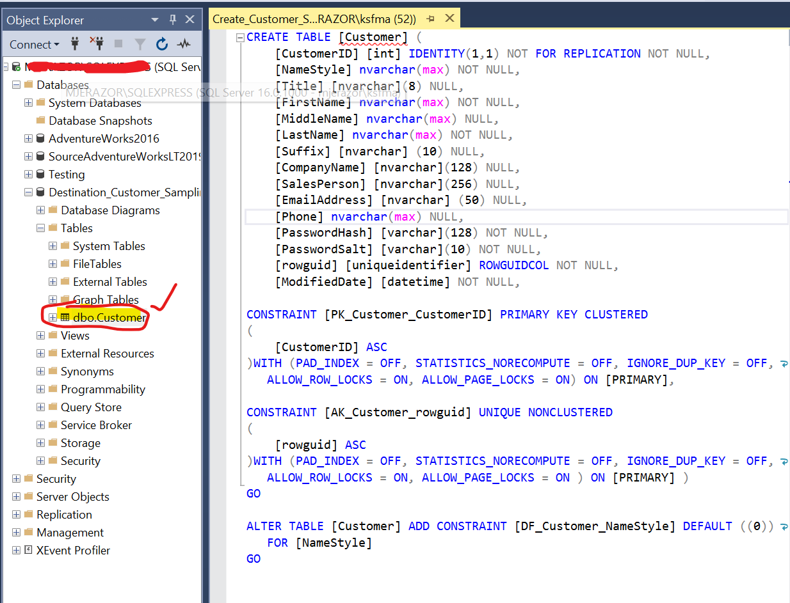

# WebScrape Based ETL and Migration
  

  **N.B This project is in its alpha phase**

  ## Project Background 📝

Shif

<TODO : make sure to later add how milestone inforamtion is organised, if there is code then add a section on File structure and Usage instructions and Install Requirments>

## Cloud Architecture

<Add architecture here>

  ## Table of Contents 🗒

  * [Milestones](#milestones-💻)

    * [Milestone 1](#milestone-1)
    * [Milestone 2](#milestone-2)
    * [Milestone 3](#milestone-3)
    * [Milestone 4](#milestone-4)
    * [Milestone 5](#milestone-5)
    * [Milestone 6](#milestone-6)

  * [License](#license-📛)
  
  * [Contributors](#contributors-😃)

  * [Questions](#questions)
  ## Milestones  💻

 ### Milestone 1
 
**Background** 

This milestone mainly deals with the installation and setup of all the necessary software and extension modules needed for the project. The outline and description of each of the services and packages used are provided below.

SQL Server is a `relational database management system` (RDBMS). Its primary function is `storing` and `retrieving` data requested by applications. These applications may run on the same computer or another computer across a network or the internet. 

The `Adventure Works` sample is an OLTP (online transaction processing) database. The AdventureWorks database supports a fictitious, multinational manufacturing company called Adventure Works Cycles.

link to DB -> (https://github.com/Microsoft/sql-server-samples/releases/tag/adventureworks)

On the other hand, `Visual Studio` is an integrated development enviroment (IDE), a tool used to develop computer programmes, web apps, web services and mobile apps. Visual Studio comes with various `workloads`, a bundle of tools that aid in further productive development.

Then, `SQL Server Data Tools (SSDT)` is a modern development tool for building SQL Server relational databases, Azure SQL Databases, Analysis Services data models, Integration Services packages and Reporting Services reports.

Finally, `SSIS, SSAS and SSRS` are incorporated as part of SQL Server Data Tools. This is present as the extensions for Visual Studio, the extensions are `SQL Server Integration Services Projects` (SSIS), then `Microsoft Reporting Services Projects` (SSRS) and then finally, `Microsoft Analysis Services Projects` (SSAS).

**Outline** 

In this milestone, we first setup the SQL Server, then the we download the sample database `AdventureWorks dataset` version 2016. The *SQL Server (Developer version) 2019*  is then made to connect with *SQL Server Management Studio 2019*. Then, the database is restored as shown below.

Next, we install Visual Studio 2019 (the Community edition). Three workloads need to be chosen, the ASP.Net Core web development workload, the .NET Framework for desktop development and cloud engineering and the Data storage and processing. Once setup, the apppropriate SSIS, SSRS and SSAS extensions need to be installed.

---

 ### Milestone 2
 
**Background** 

This milestone focuses on developing an ETL pipeline using SSIS.

The `SQL Server Integration Services` (SSIS) is a platform for building enterprise level data integration and data transformation solutions. With SSIS, complex business problems can be solved copying and downloading files, sending email messages in response to events. Can be used to updating `data warehouses`, cleaning and mining data, extract, transform data from various sources and also managing SQL Server Objects and data.

ETL stands for extract, transform and load. It is a process that sets a `data pipeline`. First, we collect data from various soruces. Second, we transform the data according to business rules (e.g. filtering, sorting, aggregating, joining, cleaning, de-duplication and/or validating) and thirdly we load data into a `destination data store` or a `data warehouse`. 

Data can be extracted data `homogenous` (one source) or `hetergenous` (several) sources. Transformation process is heavily influenced by business requirements, e.g. the right type and format of data needs to be ensured.

**Outline** 

In this milestone we setup our ETL pipeline. First, we download source `source` tables as part of AdventureWorks lightweight tables (i.e. AdventureWorks LT) version 2019. This can be obtained from https://github.com/Microsoft/sql-server-samples/releases/tag/adventureworks. We download the `AdventureWorksLT2019.bak` and restore this into our SSMS as a seperate table. This table acts as the source table.

Secondly, we set te destination database, we create a new database. We give it the name `CustomerSampling`. This table will have the same schema as the source database table `SalesLT.Customer` hence the primary keys, the columns and the column types will mimic exactly the ones for the source so in order to prevent issues when transferring from source to destination. The script for generating the destination table is in the file `Create_Customer_Sampling_DB`. The process is outline below.

Thirdly, in order to transfer the database, we are going to develop our own ETL pipeline. We first setup a new SSIS project called `SSIS Amazon ETL Pipeline`.

<!-- Extracting data from the table Customer in the source database AdventureWorksLT2016

We will Manipulate and uppercase the  Customer.CompanyName
Will will then Load data into table Customer in the destination database
that will be called CustomerSampling
(Both the source and destination database will be on the same
SQL Server in this course. But  in an enterprise environment
they most likely will be on different SQL Servers. )
I will show you how to install the source database and create the destination database. -->

---

 ### Milestone 3

Once the migration 

---

### Milestone 4

With the success 

---

### Milestone 5

Having setu

---

### Milestone 6

The migration is completed, it is time that business presents 

## Known Issues

* In the scenerio if VS 2019 is unable to install Microsoft ASP45.Net, simply enable updates and modules installer in the Services manager.

## License 📛 

Copyright @ MIT. All rights reserved.

Licensed under the MIT license.

## Contributors 

Mahed Javed - ksfmahed@outlook.com

## Questions

For additional questions, contact me at the email provided below. 

- GitHub: [mahedjaved](https://github.com/mahedjaved/)
- Email:  mahed95@gmail.com